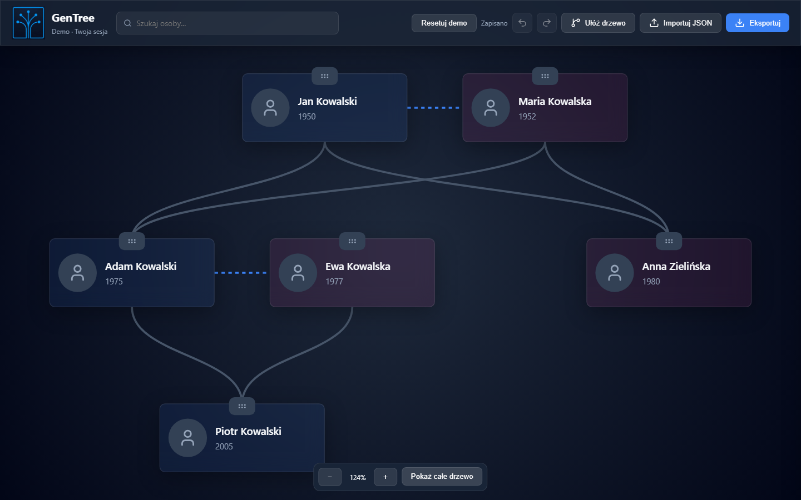

# GenTree — Interactive Family Tree Editor

[](https://github.com/Krogullec789/GenTree/actions/workflows/ci.yml)

GenTree is a family tree editor built with **React, TypeScript and Vite**, backed by an **Express API**. It lets users explore family relationships, edit personal profiles and arrange people on an interactive canvas.

I started this personal project to explore a simpler, self-hosted approach to family tree editing. The engineering focus is on interactive React UI, graph validation, state history and versioned persistence. The application UI is in Polish.

[Try the live demo](https://krogullec789.github.io/GenTree/) · [Watch the short product tour](docs/media/gentree-tour.webm) · [Mobile screenshot](docs/media/gentree-mobile.png)



The demo uses fictional people and stores edits in your browser tab's session. It
survives reloads, never calls the backend and does not share edits with other
visitors. Closing the tab ends the session; export JSON to keep your work. Use
**Resetuj demo** to restore the sample family (a backup downloads first).

A quick tour: open a person → add a child → arrange the tree → undo/redo → export.
On a phone, use **Pokaż całe drzewo**, the zoom buttons and drag the background to navigate.

## Features

- **Interactive canvas:** pan with mouse or touch, zoom toward the cursor or with buttons, fit the whole tree, and move people with a drag handle or keyboard arrows.
- **Family relationships:** create parent-child and partner connections, or link people already in the tree.
- **Profile editing:** update names, birth and death dates, biography and avatar URL.
- **Person search:** find a person and focus the canvas on their profile.
- **Automatic layout:** arrange family branches by generation and group partners together.
- **Undo and redo:** navigate a bounded history of tree changes.
- **Automatic saving:** debounce edits, serialize requests and coalesce pending changes; retry network failures and recover from conflicts through a backup and reload. Empty trees persist correctly.
- **JSON import and export:** validate imported data and download a backup before replacing the current tree.

## Tech stack

| Area | Technologies |
| --- | --- |
| Frontend | React 19, TypeScript in strict mode, Vite, CSS, Lucide icons |
| State | React Context, hooks and an in-memory snapshot history |
| Visualization | HTML person cards, SVG relationship paths and Pointer Events |
| Backend | Node.js, Express 5, file-based JSON storage |
| Testing | Vitest, React Testing Library, Supertest and Playwright |
| Automation | GitHub Actions: lint, type checking, tests and production build |

## Architecture and decisions

**Graph model.** People and relationships are stored in maps keyed by ID. Shared validation checks required fields, dates, missing references, duplicate connections and cycles in parent-child relationships. The API, imports, committed edits and demo storage use this validation. Imports reject malformed array entries and duplicate IDs with their location in the file.

**Interactive rendering.** Person cards use HTML so profiles and controls can use standard browser elements. Relationships are drawn in an SVG layer. The canvas calculates which cards fall within the viewport and an overscan area; a separate layout function computes positions without rendering UI.

**State and history.** `TreeProvider` coordinates committed edits, selection and undo/redo with a limit of 50 snapshots. Profile fields keep local drafts and commit valid changes on blur (or Enter for single-line fields); Escape discards the draft. Each field edit and each new relative with its relationship is one undo step. Invalid drafts show inline errors and leave the last valid saved value intact. Transient pointer coordinates live in a separate store; only relationship lines subscribe to its updates. The dragged card updates locally and commits its position once on release. Cancelling a gesture leaves the saved position intact. See the [reproducible rendering experiment](docs/performance.md).

**Autosave queue.** At most one request is in flight. Edits made during that request replace the pending snapshot; the next request uses the version returned by the previous one. A conflict pauses writes while preserving local edits, and reloading the server version first offers a JSON backup. Failed requests require an explicit retry. A before-unload prompt warns about pending writes.

**Demo isolation.** The same editing UI runs against a session-storage adapter in demo mode. `npm run build:demo` produces a static site with no backend dependency; the regular build uses the Express API. Both modes use the same history and save queue.

**Versioned persistence.** The API returns a tree version and requires it in the `If-Match` header for updates. Stale writes return a conflict response. The repository serializes writes within one server process and writes through a temporary file before renaming it. JSON storage keeps local setup small; it is intended for a single-process prototype.

```text
src/
  components/       Canvas, person cards, toolbar and profile editing
  store/            Tree state, serialized autosave, storage adapters and drag store
  types/            Shared TypeScript data models
  utils/            Tree validation and automatic layout
  server/           File-based tree repository
tests/
  backend/          API, validation and persistence tests
  e2e/              Browser smoke tests
scripts/            E2E runner and local verification
server.ts           Express API entry point
```

Component and state tests also live next to the corresponding source modules in `__tests__` directories.

## Run the demo locally

With dependencies installed, run `npm run dev:demo`. No `.env` setup, database or
API process is needed. You can also open `/?demo` on the regular dev server.

`npm run verify:demo` builds the static demo and checks its assets and
edit-save-reload flow under `/GenTree/`, matching the GitHub Pages project path.
`npm run demo:capture` regenerates the screenshots and video using fictional data.

## Run locally

Use **Node.js 22.13 or newer within the 22.x release line**, with npm. `.nvmrc` selects Node.js 22, which is also used in CI.

```bash
git clone https://github.com/Krogullec789/GenTree.git
cd GenTree
npm ci
```

Create the local configuration and sample database on first setup:

```bash
cp .env.example .env
cp db.json.example db.json
```

In PowerShell, use:

```powershell
Copy-Item .env.example .env
Copy-Item db.json.example db.json
```

Keep `TREE_API_TOKEN` and `VITE_API_TOKEN` equal in your local `.env`, then start both servers:

```bash
npm run dev
```

Open [localhost:5173](http://localhost:5173). The API runs at `http://localhost:3001`. The sample database contains fictional people. Local `.env` and `db.json` files are ignored by Git; export your tree before replacing an existing database.

## Testing and CI

Install the Chromium browser used by Playwright once:

```bash
npx playwright install chromium
```

| Command | Purpose |
| --- | --- |
| `npm run lint` | Run ESLint |
| `npm run typecheck` | Check TypeScript types |
| `npm test` | Run unit and integration tests |
| `npm run build` | Check types and create the frontend production build |
| `npm run test:e2e` | Run editing, deletion, import, conflict, retry, demo and mobile workflows |
| `npm run test:performance` | Reproduce the drag subscription experiment |
| `npm run verify:demo` | Build and verify the production demo under a project subpath |
| `npm run verify:quick` | Run lint, type checking and unit/integration tests |
| `npm run verify:app` | Check the local database and application in Chromium |
| `npm run verify:full` | Run all verification steps, including the local app check |
| `npx playwright show-report` | Open the latest browser test report |

Unit and integration tests cover graph validation, layout rules, API conflicts,
atomic relative creation, field validation, grouped history, strict array imports,
empty-tree persistence and autosave ordering under a slow network. E2E
tests use a real isolated API and verify edit-save-reload, deletion of the last
person, layout-drag-history, invalid/valid imports, two-tab conflicts, network
recovery, demo isolation and a narrow mobile viewport. Screenshot/video capture is
opt-in and is skipped during ordinary CI.

The [CI workflow](.github/workflows/ci.yml) runs on pushes to `main`, pull requests targeting `main`, and manual dispatch. It runs two validation jobs and a deployment job:

1. ESLint, TypeScript checks, unit/integration tests and a production build.
2. Playwright user workflows with Chromium, an isolated database and a test-only API token.
3. After both pass on `main`, build and verify the isolated demo, then publish it to GitHub Pages. Pull requests never deploy.

The jobs install dependencies with `npm ci`. Browser reports and available failure traces are retained as the `playwright-results` artifact for 14 days. CI does not require repository secrets or your local `.env` and `db.json` files.

`verify:app` is a separate local diagnostic: it requires the local configuration, an initialized database with people, Chromium, and free ports 5173 and 3001. It currently expects every person in that database to be rendered, so it is best used with the small sample tree. It is not part of the hosted CI workflow.

## Deployment

The `demo` job in [.github/workflows/ci.yml](.github/workflows/ci.yml) publishes only
the static demo. GitHub Pages must use **GitHub Actions** as its publishing source
([GitHub documentation](https://docs.github.com/en/pages/getting-started-with-github-pages/using-custom-workflows-with-github-pages)).
Publishing is gated by unit/integration tests, E2E tests and a production-demo browser check.

## Current scope and next steps

The API-backed application is a local, single-tree prototype. JSON storage assumes
one server process. There are no user accounts or per-user access controls;
`VITE_API_TOKEN` is shipped in the regular browser build and is a development
convenience, not public-deployment authentication. The public demo bypasses the API
and stores no real family data on the server.

Known limits: history snapshots can become expensive for very large trees; SVG
paths are recalculated during dragging; the rendering experiment measures React
subscriptions rather than browser FPS. Mobile zoom uses explicit buttons, with
one-finger panning; pinch-to-zoom is not implemented. Session storage is finite,
and storage failures are surfaced through the save error and export controls.

Next investigations:

- Profile large, realistic family graphs in a production browser build.
- Improve relationship-line routing for dense families and multiple partnerships.
- Extend keyboard navigation between people on the canvas.
- For a multi-user edition, introduce a database, migrations and per-tree access control.

## License

[MIT](LICENSE)
